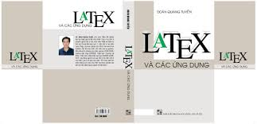

# latex_examples  
Sources code for latex examples for report, thesis, article, presentation, book 
see .pdf file to know how it looks like in output. 
To run code, just check .bat file, and run .bat file on windows. 
For Linux and MacOs, see online google docs. 

Attention!, on windows you need to install MikTeX, on Linux install Texlive, on macOS install macTex etc. 

Theses examples are source codes of examples presented in the book: "Latex và các ứng dụng" written in vietnamese, 500 pages, by author Doan Quang Tuyen. (name of book in english is "Latex and applications) 

Enjoy!

Doan Quang Tuyen.
